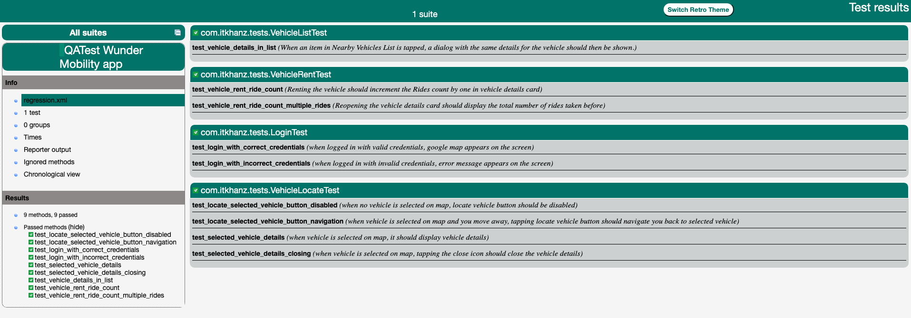

# Appium WM Assignment

* This project is a solution for the QATask assignment and automates important scenarios for the automation
* This is by no-means a full fledged automation framework, rather a solution to a challenge task.

## Pre-requisites

This project ia built and tested with the following dependencies:

* JAVA JDK 17.0.2
* MAVEN 3.9.2
* Node 18.16.0
* Appium Server 2.0.1 or higher
* Appium UiAutomator2 driver 2.29.4 or higher
* Android Studio
  * Android SDK and commandline tools
  * Android Emulator
    * Pixel 5 with Android 13.0 Google Play | x86_64

> Use appium doctor to check if your system has been successfully setup with appium


## Libraries

* [Java 17](https://openjdk.org/projects/jdk/17/) as programming language
* [Appium Java Client 8.6.1](https://mvnrepository.com/artifact/io.appium/java-client/8.6.0) as native app automation library
* [TestNG](https://mvnrepository.com/artifact/org.testng/testng/7.8.0) as testing framework to support the test creation and hooks
* [AssertJ](https://assertj.github.io/doc/) as the fluent assertion library
* [java-faker](https://github.com/DiUS/java-faker) as the faker data generation strategy
* [Log4j2](https://logging.apache.org/log4j/2.x/) as the logging management strategy
* [Owner](https://github.com/matteobaccan/owner) to minimize the code to handle properties files
* [Lombok](https://projectlombok.org/) to reduce the boilerplate and creating POJOs with builder pattern
* [jackson-databind](https://github.com/FasterXML/jackson-databind) to parse the JSON test data

## Running Tests

* Open the project `POM.xml` in IDE of your choice and run the maven build that will download and install the required dependencies.
  * IntelliJ IDE is recommended.
* Configure the following according to your system setup:
  * appium server host and port inside `src/test/resources/server.properties`
  * android UDID of the emulator inside `src/test/resources/android.properties`
* Use IDE Terminal or navigate to the project root directory and run following command in terminal:
```shell
mvn clean test -Pregression
```
* It will run the whole regression suite comprising of 11 test cases split between 4 test classes.
* Results will be available in terminal after the build is finished.
* HTML report is generated by mavens surefire plugin, and is available at `target/surefire-reports/index.html`


